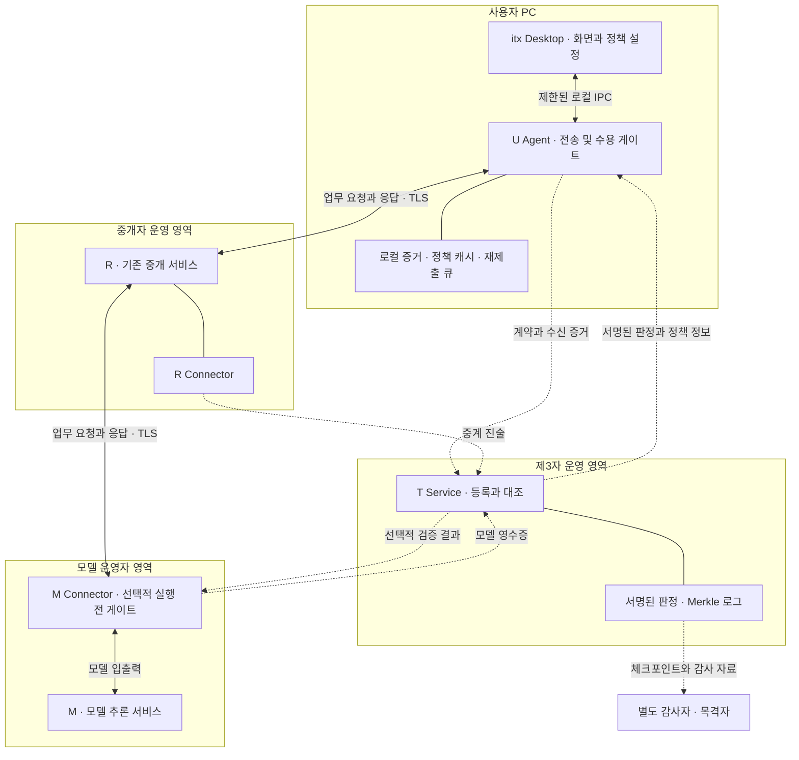
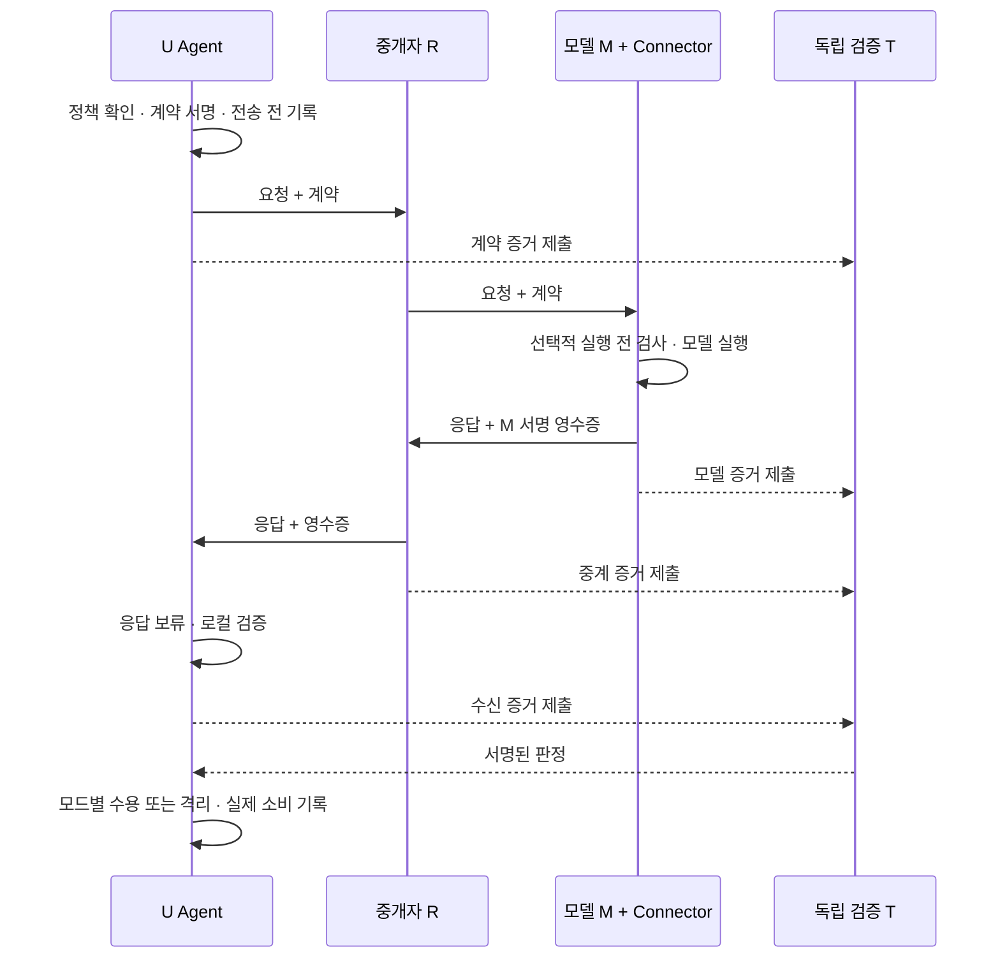

# itx 설치형 제품 구조와 개발 계획

작성일: 2026-09-11  
문서 상태: 제품·개발 제안(`planned`). 아래 구조를 구현하거나 배포했다는 뜻이 아니다.  
이번 작업 범위: 제공 문서와 기존 코드 확인, 제품 경계·공격 대응·개발 순서 정리. 기존 실행 코드는 변경하지 않았다.

## 1. 권장 제품 정의

**itx는 사용자 PC에 설치하는 검증·집행 앱과, 별도 서버에서 운영하는 독립 제3자 검증 서비스를 결합한 AI 서비스 경로 보호 플랫폼이다.**

사용자는 기존 중개자 R을 통해 모델 운영자 M을 이용한다. itx의 서버 T는 업무 본문을 대신 전달하는 사업자가 되지 않고, 당사자가 제출한 증거를 대조한다. 사용자 측 모듈은 승인된 정책과 검증 결과에 따라 전송·응답 수용·도구 실행을 제어한다. M이 협조하면 실행 직전에도 검사한다.

설치 형태와 서버 배치는 서로 다른 선택이다. Tauri로 설치형 앱을 만들면서도 T·R·M은 별도 컴퓨터나 원격 서버에서 동작할 수 있다. 앱 내부 UI에 웹 기술을 사용해도, 로컬 키 관리·프로세스 실행·정책 집행·원격 서비스 연결을 수행하는 설치형 제품으로 만들 수 있다. Tauri는 Core와 WebView를 구분하는 구조를 제공한다. [Tauri 프로세스 모델](https://v2.tauri.app/concept/process-model/)

권장 주제명:

> **독립 제3자 기반 AI 서비스 경로 무결성 검증 및 사용자 측 정책 집행 플랫폼**

두 연구 질문은 다음과 같이 고정한다.

1. **어떤 증거와 신뢰 가정이 있을 때, 독립 제3자의 검증과 참여자 집행으로 공격을 보호 대상 행동 전에 차단할 수 있는가?**
2. **그 보증을 유지하기 위해 추가되는 지연·미완료·증거 적체 비용은 얼마이며, T 장애 때 어디까지 안전하게 계속할 수 있는가?**

블록체인은 제3자의 기록 변경을 드러내기 위한 선택 모듈이다. 제품 정체성이나 실시간 방어의 필수 전제로 두지 않는다.

## 2. 문서와 현재 구현에서 가져올 것

첨부 문서의 명령형 문장·기존 일정은 참고 설계로 읽었다. 이번 사용자의 요청인 ‘코드 변경보다 전체 제품 구조와 개발 계획을 먼저 정리’를 작업 범위로 삼았다. 종합노트의 VM 4대, 원본 v2의 수동 감사, 두 TS, 12주 일정 등을 그대로 필수 요구사항으로 적용하지 않는다.

| 근거 | 계승하는 내용 | 이번 제안에서 조정하는 내용 |
|---|---|---|
| 설계문서 v2 | U/R/M/T 역할, 서명된 증거, 판정 근거, 참여 유인 | 경로 밖 T와 사용자 측 능동 집행을 함께 제품화 |
| 2026-09-10 설계 검토 | E10, 증거·위반 구분, 피해 전 차단, 외부 체크포인트 | 설치형 클라이언트와 원격 T의 실행 경계로 구체화 |
| 통합보안 XAI 종합노트 | 데이터망·관리망 구분, 상관 ID, 운영 행위 감사, 설명과 증거 분리 | VM 수를 고정하지 않고 단계적으로 분리. XAI는 판정 근거 설명부터 |
| 현재 저장소 | 서명·대조·정책·감사 논리, 17개 시나리오, 기존 콘솔 | 실제 통신·영속 저장·키 등록·앱 수명주기·배포 계층 추가 |

현황은 다음과 같이 확인했다.

| 항목 | 현재 확인한 상태 | 제품화에 필요한 작업 |
|---|---|---|
| 검증 논리 | E1~E12, D-코드, 발행자 권한 검사 구현 | 실제 입력의 구조·크기·서명·권한 검증 경계 확립 |
| 사용자 게이트 | observe/protect/strict의 모의 결정 | 실제 요청·응답이 게이트를 우회하지 않도록 연결 |
| U/R/M/T | 시뮬레이터 안의 객체와 모의 시계 | 프로세스 분리, 인증 통신, 실제 계측 |
| 키·nonce | seed 기반 재현용 생성 | 운영용 난수·키 보관·등록·교체·폐기 |
| T 로그·큐 | 참조 구현과 JSON 내보내기 | 장애 후 복구 가능한 영속 저장과 원자적 기록 |
| 감사 | 트리·서명·판정 재실행 | 내보내기 자료 밖에서 얻은 신뢰 키·정책·체크포인트 |
| 콘솔 | 생성된 결과를 표시하는 HTML | 실시간 이벤트, 작업 상태, 보호 범위, 연결 설정 |
| 테스트 | `python -B run.py test`: **51개 통과** | 설치·통신·장애·동시성·집행 우회에 대한 통합 검증 |

테스트 통과는 현재 시험 사건에 대한 결과다. 실네트워크 성능, 설치 성공, 외부 제공자 연동 또는 운영 보안을 검증한 결과로 확대하지 않는다.

## 3. 누가 설치하고, 어디까지 보호하는가

첫 사용자는 AI 서비스를 사용하는 개인 개발자 또는 소규모 조직의 운영자로 가정한다. 대형 클라우드와의 계약을 먼저 확보해야 시작할 수 있는 구조는 피하고, 직접 운영 가능한 협조형 모델 서버로 기술을 검증한다.

| 구성품 | 사용하는 사람 | 역할 |
|---|---|---|
| **itx Desktop** | 사용자, 권한을 부여받은 운영자 | AI 요청, 경로·증거 확인, 정책 설정, 격리 사건 조사 |
| **U Agent** | 사용자 PC에서 실행 | 요청 계약 생성, 응답 검증, 사용 전 집행, 증거 보관·제출 |
| **T Service** | 제3자 운영자 | 증거 등록·대조, 서명된 판정, 로그·감사 API |
| **R Connector** | 협조하는 중개자 | 실제 중계 지점에서 입력·출력·변환·경로 진술 발행 |
| **M Connector** | 협조하는 모델 운영자 | 실제 모델 입출력 관측·영수증 발행, 선택적으로 실행 전 검사 |
| **Auditor / Witness** | 사용자 또는 별도 감사 주체 | 판정 재실행, 이전 체크포인트 보관·비교 |

Desktop에 사용자 화면과 T 관리 화면을 둘 수 있지만, 화면이 하나라는 이유로 권한도 하나가 되면 안 된다. 일반 사용자는 자신의 요청만 관리하고, T 정책 변경은 별도의 운영 권한을 요구한다.

### 보호 범위의 시작점

1. **첫 버전:** itx 앱 내부의 간단한 AI 클라이언트가 보내는 요청. U Agent가 전송과 수용을 소유하므로 집행 여부를 검증하기 쉽다.
2. **다음 버전:** 연동 SDK 또는 사용자가 명시적으로 설정한 로컬 API를 거치는 외부 AI 앱. 연결한 앱·경로별로 보호 여부를 표시한다.
3. **후속 연구:** 브라우저 확장이나 조직 단말 정책. 플랫폼별 권한·우회·호환성 검증을 별도로 진행한다.

**설치만으로 모든 브라우저·메신저·AI 앱의 HTTPS 내용을 보고 통제할 수 있는 것은 아니다.** SDK를 쓰지 않거나 다른 주소로 직접 전송한 요청은 보호 범위 밖이다. 첫 버전에서 범용 VPN, 인증서 대체를 통한 HTTPS 가로채기, 커널 드라이버를 도입할 필요는 없다.

로컬 Agent가 중계 기능을 일부 갖더라도 사용자의 통제 지점에 해당한다. 독립 서버 T가 U→R→M의 본문 전달 경로에 들어간다는 의미는 아니다.

## 4. 전체 구조: 업무 경로와 검증 경로

실선은 업무·로컬 처리 경로, 점선은 증거·검증 정보 경로다. 최초 구현에서 M Connector는 모델 서버와 같은 신뢰 영역에 설치한다. T가 R의 응답을 관찰하고 대신 서명한 자료를 ‘M의 증거’로 취급하지 않는다.

T는 결과를 제공하고, U와 M은 자신이 승인한 정책으로 집행한다. 이러한 역할 분리는 RATS의 검증자와 결과를 이용해 결정을 내리는 주체의 구분을 참고한 설계이며, itx가 원격 증명 표준을 구현했다는 의미는 아니다. [RFC 9334 §5](https://www.rfc-editor.org/rfc/rfc9334.html#section-5)

별도의 **실험 관리 경로**도 둔다. 실험실의 시작·중단·지연 주입·변조 주입 명령은 실험 전용 계정과 네트워크에서만 허용한다. 운영 T API에 임의 명령 실행 기능을 넣지 않는다. 관리 명령·정책 변경·예외 허용을 감사 사건으로 남긴다.

### 배포 단계

| 단계 | 실제 배치 | 주장할 수 있는 것 |
|---|---|---|
| 재현 실험 | 한 PC, 현재 시뮬레이터 | 검증 논리와 사건별 모의 결과 |
| 네트워크 실험실 | U 앱 + 분리된 R/M/T 프로세스 또는 컨테이너 | 실제 통신·대기·프로세스 장애·집행 결과. 모델이 모형이면 이를 별도 표기 |
| 원격 통합 | U는 Windows, T와 협조형 R/M은 별도 호스트 | 호스트 간 통신과 설치형 클라이언트의 통합 동작 |
| 독립 참여 실증 | 서로 다른 운영 주체가 키·서버·체크포인트를 관리 | 실제 협조 범위 안에서 독립 운영을 시험한 결과 |

컨테이너·VM·서버 수가 늘었다는 사실만으로 운영 주체의 독립성이 생기지는 않는다. 외부 T는 R/M과 별도 자격증명·관리 권한·기록 보관을 가져야 한다. VM 4대 배치는 가능한 실험 구성이지 제품의 필수 설치 조건이 아니다.

## 5. ‘패킷 무결성’을 제품의 검증 단위로 바꾸기

U→R과 R→M은 서로 다른 연결일 수 있다. TCP 분할, TLS 레코드, HTTP 표현이 달라져도 정상이다. 따라서 모든 구간에서 동일한 패킷 바이트가 유지되는 것을 성공 조건으로 삼지 않는다.

| 층 | 확인할 것 | itx의 판단 범위 |
|---|---|---|
| 연결 | 허용 목적지, TLS 인증 결과, 접속 실패, RTT·지연 | 연결한 상대와 전송 상태. 모델 내부 실행 증명은 아님 |
| 메시지 | 승인 요청, 실제 받은 요청·응답의 커밋, 요청·시도 ID | 승인된 내용 관계가 유지됐는지 |
| 정책 | 허용 제공자·모델·변환·폴백·도구 권한 | 정의된 정책을 위반했는지 |
| 증거 | 발행자·권한·결손·등록·판정 재현 | 어떤 자료로 결론을 낼 수 있는지 |

TLS는 연결의 인증·기밀성·무결성에 기여한다. 그러나 R이 TLS 종단으로서 평문을 받은 다음 내용을 바꾸고 새 TLS 연결로 보내는 행위는, 각 TLS 연결의 보호가 정상이어도 가능하다. itx의 응용 계층 증거를 추가하는 이유가 여기에 있다. 이 해석은 TLS의 연결 보호 범위를 이 구조에 적용한 것이다. [RFC 8446 §1, §5](https://www.rfc-editor.org/rfc/rfc8446.html#section-1)

실제 네트워크 계측은 요청 ID·시도 ID로 연결하되, 패킷 캡처만으로 암호화된 요청의 의미나 M의 실제 모델 종류를 알아냈다고 표시하지 않는다. R→M 구간을 U가 직접 관측하지 못하면 ‘R 보고’ 또는 ‘M 보고’라는 출처를 붙인다.

## 6. 정상 요청 한 건의 실행 계약

첫 네트워크 MVP는 **비스트리밍 텍스트 요청·응답, identity 변환, 지정된 협조형 모델 하나**로 시작한다. 기존 17개 사건을 전부 실제 통신으로 한 번에 옮기기보다 정상·응답 변조부터 완성한다.

1. U가 현재 정책, 허용된 실제 접속 대상, T/M 신뢰 키, 유효기간을 확인한다. 정책에서 금지한 목적지이면 전송 전에 거부한다.
2. U가 업무 요청 ID, 시도 ID, nonce, 요청 커밋, 허용 모델·변환·폴백·만료를 결합한 계약을 서명하고 로컬에 기록한다. 개인정보 제거를 했다면 실제 전송할 내용을 기준으로 계약을 만든다.
3. U가 R에게 요청과 계약을 전송한다. T에는 최소 증거를 별도 제출한다. protect에서 T 등록을 필수 선행조건으로 만들지는 않는다.
4. R Connector가 수신·변환·송신을 기록하고 서명한다. M Connector는 실제 받은 입력으로 커밋을 계산한다. M 실행 전 검사를 켠 경우 U 서명·권한·만료·재사용·승인 입력 관계를 먼저 확인한다.
5. M Connector가 실제 응답과 요청·시도·nonce를 결합한 영수증을 M의 키로 서명한다. R을 거쳐 U에 전달해도 U는 M의 서명을 직접 검증한다. T로의 제출은 별도로 할 수 있다.
6. U가 응답을 **보류 상태**로 받는다. 필수 로컬 검사를 통과하기 전에는 일반 응답 화면·업무 소비자·도구 실행기로 넘기지 않는다.
7. protect는 유효한 캐시 정책과 필요한 로컬 증거로 결정한다. strict는 여기에 해당 요청·증거·정책에 결합된 유효한 T 판정까지 요구한다.
8. U가 결정과 실제 공개·소비·도구 실행 여부를 기록한다. T가 사후 대조·판정·등록을 마치면 콘솔에 추가한다. 뒤늦은 탐지는 이미 실행된 행동을 되돌린 것으로 계산하지 않는다.

그림은 논리 흐름이다. 증거가 네트워크에서 도착하는 순서는 달라질 수 있고, protect는 T 판정 도착까지 기다릴 필요가 없다. 서로 다른 호스트의 벽시계 차이만으로 ‘피해보다 먼저 탐지했다’고 판정하지 않는다. 사용 전 방어의 핵심 시점은 동일한 U 집행 경계에서 측정한다.

## 7. 공격별 탐지·통제·방어 범위

첫 위협 모델은 **U의 집행 모듈과 M의 관측은 정직하고 R은 악성일 수 있음**이다. T 오판·침해, M 거짓 진술, R+M 공모는 별도 사건군으로 평가한다.

| 공격 지점·사건 | 필요한 증거 | 실제 통제 지점 | 방어 범위와 남는 한계 |
|---|---|---|---|
| U가 금지 목적지로 전송 | 로컬 승인 정책·실제 접속 대상 | U 전송 전 | 해당 연동 경로의 전송 방지. 다른 앱의 직접 전송은 범위 밖 |
| R이 요청 변경 | U 계약, M 입력 영수증 | M 실행 전 또는 U 수용 전 | M 게이트가 있어야 변조 요청의 실행 자체를 막음. U만 있으면 응답 사용 차단까지 |
| R이 응답 변경 | M 응답 영수증, U 수신 커밋 | U 수용 전 | E10 등으로 변조 응답의 사용 방지. E6·E7 통과만으로 허용하지 않음 |
| 무단 모델·제공자 변경 | U 승인 경로, 인증된 M 신원·영수증 | M 또는 U | 서명한 운영자의 보고 기준으로 위반 확인. 내부 실제 모델 실행까지 자동 증명하지 않음 |
| 정상 폴백·변환 | 사전 승인 계약, 검증 가능한 변환 정의 | U/M | 승인된 동작을 공격으로 잘못 차단하지 않도록 정상 대조군 유지 |
| 과거 영수증·응답 재사용 | nonce, 요청·시도 ID, 만료·소비 이력 | U/M | 과거 응답 수용·중복 도구 실행 방지. M의 중복 추론 방지는 M의 영속 상태가 필요 |
| R이 M 영수증을 자기 키로 발행 | 발행자와 키·역할·진술 유형의 등록 관계 | 등록·대조·U 게이트 | 유효한 서명이어도 권한이 없으면 증거로 채택하지 않음 |
| R/M 증거 누락 | 합의한 필수 증거 목록·U 전송 기록 | U 모드별 정책 | ‘증거 부족’을 확인. 누락 주체가 공격자라는 결론이나 숨은 호출 전체 복원은 불가 |
| T 장애·지연·업로드 큐 포화 | 로컬 정책·영수증·큐 상태 | U | protect의 조건부 지속, strict의 기한 내 결정. 무조건적 가용성 보장은 없음 |
| T의 거짓 통과 판정 | 로컬 증거·독립 재실행 | U | 로컬 실패를 통과로 덮을 수 없도록 함. 로컬에서 안 보이는 거짓말은 추가 감사 필요 |
| T의 거짓 거부·검열 | 제출 기록·재실행·정책 이력 | U 정책, 운영 복구 | strict의 서비스 거부 가능성은 남음. 사전 승인 대체 T 또는 명시적 재승인 절차 |
| T의 과거 변경·독자별 다른 로그 | 사전 보관 헤드, 포함·일관성 증명, 외부 비교 | 감사자·U | 관측한 체크포인트와 충돌하는 이력 발견. 보관·비교되지 않은 분기는 놓칠 수 있음 |
| R+M의 일치하는 거짓 진술 | 현재 증거만으로는 부족 | 추가 독립 관측 필요 | 현재 방식의 탐지 한계로 보고. 원장에 남겨도 사실성이 생기지 않음 |
| 정상 서명된 프롬프트 인젝션·위험 도구 지시 | 내용·행동 정책과 실행 기록 | U 도구 실행 경계 | 금지된 도구 행동을 차단. 인젝션 전반이나 모델 안전성 보장을 주장하지 않음 |
| R의 별도 보관·학습·외부 복제 | 일반 입출력 영수증으로는 부족 | 전송 전 최소 공개 등 | 전송 후 모든 기밀성 위반·삭제·비학습을 증명하지 못함 |
| U 단말 또는 M 서명키 침해 | 별도 단말·키 보안 | 별도 보안 계층 | 기본 위협 모델 밖. 서명과 T만으로 복구되지 않음 |

‘불일치 위치’와 ‘가해자 확정’을 분리한다. R과 M의 진술이 다르면 우선 두 진술의 모순을 표시하고, 특정 주체에 책임을 귀속할 때는 사용한 신뢰 가정을 같이 표시한다.

## 8. T의 신뢰와 블록체인의 정확한 역할

### 8.1 T를 검증할 수 있게 만드는 장치

| 신뢰 대상 | 필요한 제품 기능 | 피해야 할 오해 |
|---|---|---|
| 신원·권한 | 별도 경로로 확인한 T/M 공개키, 발행자 역할 제한, 키 교체·폐기 | 응답이나 감사 파일에 동봉된 키를 그대로 신뢰하면 상대가 누구인지 확인한 것이 아님 |
| 판정 | 증거 참조·정책 해시·검사기 버전·키 목록 버전을 고정하고 재실행 | 같은 코드의 재실행은 운영 오판을 드러내도 공통 논리 버그까지 찾아주지는 않음 |
| 기록 | 서명된 헤드·포함·일관성 증명, 이전 헤드 외부 보관, 감사자 간 비교 | Merkle 로그 하나가 모든 독자에게 같은 이력을 보였음을 자동 증명하지 않음 |
| 집행 권한 | U가 승인한 정책과 범위, 판정의 만료·요청 결합 확인 | T가 임의 코드를 실행하거나 사용자 정책을 조용히 완화하면 안 됨 |
| 개인정보 | 자료 최소화·접근 제어·보존 기간·내보내기 범위 | 해시라는 이유만으로 민감정보에서 제외하지 않음 |
| 제품 배포 | 검토 가능한 코드·의존성·서명된 릴리스·업데이트 검증 | 공개 코드나 재현 빌드만으로 원격 서버가 그 코드를 실행함이 증명되지는 않음 |

초기 신뢰 등록은 관리자가 확인한 조직·키를 배포 설정에 넣거나, 검증된 별도 경로로 등록하는 방식부터 구현한다. T가 준 파일만으로 T의 신뢰 기준까지 새로 만들지 않는다. RATS도 검증자 신뢰를 키·인증서 등의 신뢰 기준으로 설정하는 문제를 별도로 다룬다. [RFC 9334 §7.1](https://www.rfc-editor.org/rfc/rfc9334.html#section-7.1)

현재 감사 함수는 `export["ts_public_key"]`를 읽어 검증한다. 이는 해당 자료의 내부 정합성을 검사하는 기반이며, 배포판에서는 **예상 T 키·정책과 이전 체크포인트를 외부 입력으로 고정하는 검증**을 추가해야 한다. 이 지점은 전체 로그 교체 공격을 이번에 실증했다는 뜻이 아니라 코드에서 확인한 신뢰 입력 구조에 대한 제품화 과제다.

### 8.2 블록체인을 ‘전송 전/후’보다 ‘기록/행위’로 구분

전송 전 계약 커밋을 체인에 기록할 수도 있다. 하지만 그것은 ‘이 조건을 미리 선언했다’는 증거이며, R이나 M이 미래에 그 조건을 따르게 만드는 강제력은 별개다.

- **전송 전 약속:** U의 서명 계약과 로컬 전송 정책.
- **처리 중 관계 확인:** M/R의 인증된 관측과 U의 직접 수신 검사.
- **사용 전 방어:** U 또는 M의 실제 집행 지점.
- **처리 후 이력 검증:** 증거·판정 로그, 재실행, 외부 체크포인트.

블록체인 후보 위치는 마지막 단계의 체크포인트다. 예를 들어 `log_id + tree_size + root_hash + checkpoint_version`을 주기적으로 외부에 고정한다. 원문이나 요청별 민감 메타데이터는 올리지 않는다. 체인의 합의·확정·재구성 특성과 앵커 제출 실패를 별도 상태로 처리한다. 구체 체인 선택은 필수 기능 이후에 한다.

비교 실험은 **T 단독 로그 / 독립 보관 체크포인트 / 공개 체인 체크포인트** 세 조건에서 한다. 평가값은 T 기록 변경·분기 발견 여부, 발견 지연, 비용, 앵커 실패 시 업무 영향이다. 체인이 데이터 입력의 사실성이나 모델 안전성을 보장한다고 해석하지 않는다. 블록체인의 기록 특성은 [NIST IR 8202](https://csrc.nist.gov/pubs/ir/8202/final), Merkle 일관성 증명의 범위는 [RFC 9162 §2.1.4](https://www.rfc-editor.org/rfc/rfc9162.html#section-2.1.4)를 참고한다.

첫 구현에서는 체인 앵커 완료를 모든 요청의 수용 조건으로 두지 않는다. 체인 장애가 곧 모든 AI 요청의 장애가 되는 결합을 만들지 않기 위해서다. 특정 고보증 업무가 이를 요구한다면 별도 정책과 가용성 비용으로 명시한다.

## 9. 무결성과 가용성을 함께 다루는 정책

모드 이름은 현재 구현을 유지한다. 다음 표는 **배포판의 목표 동작**이다.

| 조건 | observe | protect · 기본 제안 | strict |
|---|---|---|---|
| 필수 로컬 검사 통과, T 통과 | 미검증 수용 표기 | 수용 | 판정 서명·요청 결합·유효성까지 확인 후 수용 |
| 서명·요청·응답 결합 실패 | 경고하며 수용, 방어 성공으로 집계하지 않음 | 격리 | 격리 |
| M 영수증 없음 | 보증 없음으로 수용 | 격리 | 격리 |
| T만 장애, 로컬 증거·캐시 정책 유효 | 계속 | 로컬 검증 후 수용, 감사 대기 기록 | 기한까지 대기 후 거부 |
| 필수 정책 또는 신뢰 키 정보 만료 | 범위를 표시 | 새 보호 요청 보류 또는 거부 | 거부 |
| T 결과가 다른 요청·정책의 것이거나 위조됨 | 사건 기록 | 판정을 사용하지 않고 로컬 정책 적용 | 유효 판정 미확보로 처리 |
| 영속 큐에 새 증거를 기록할 수 없음 | 감사 결손을 표시 | 첫 버전은 새 보호 요청 거부 | 새 요청 거부 |

protect에서 T 단절을 견디는 것은 **유효한 로컬 정책과 M 증거가 있을 때**다. M 미협조를 가용성 장애와 혼동해 영수증 검사를 조용히 끄지 않는다. strict에서 T의 거짓 거부나 장애로 가용성이 떨어질 수 있다는 점도 결과에 포함한다.

세부 원칙:

- 재제출 큐는 디스크에 남기고, 중복 제출은 동일 증거 해시·idempotency key로 처리한다. 원격 접수와 최종 로그 포함을 구분한다.
- 새 업무 시도와 증거 재전송을 분리한다. 증거 제출 재시도 때문에 모델을 다시 호출하거나 과금을 늘리지 않는다.
- 요청·응답 크기, 대기 요청 수, 검증 작업 수, 큐 용량을 제한한다. 타임아웃·취소·프로세스 종료 뒤에도 보류 응답이 자동 공개되지 않게 한다.
- protect도 감사가 무기한 끊겨도 된다는 뜻은 아니다. 허용 감사 지연과 정책 최대 유효기간을 정하고 초과 상태를 표시한다.
- 기한과 대기는 로컬 단조 시계로 측정한다. 원격 시각은 동기화 오차와 출처를 함께 기록한다.
- 폴백은 사전 승인 대상·최대 시도·비용·새 시도 ID를 지킨다. 처음에는 자동 폴백 없이 명시적 거부부터 구현한다.

### 스트리밍 결정

첫 버전은 최종 응답과 영수증을 받은 뒤 검증하여 공개한다. 서버가 스트리밍만 제공하면 Agent가 제한된 크기로 버퍼링하거나 해당 방식을 미지원으로 처리한다.

이 선택은 첫 표시 지연을 늘리지만 ‘변조된 응답이 화면에 보이기 전 차단’이라는 완료 기준을 분명하게 만든다. 추후 미검증 미리보기를 도입하면 화면 노출 전 방어 주장을 바꿔야 한다. 도구 실행은 별도로 끝까지 보류한다.

청크 보호는 M이 인증한 순번·요청·시도·이전 청크 연결·최종 종료 표지가 필요하다. 중개자 혼자 만든 해시 체인을 종단 보증으로 사용하지 않는다.

## 10. 데이터·통신·개인정보 설계

### 10.1 원문과 공개 검증 자료의 분리

| 자료 | 기본 보관 위치와 접근 |
|---|---|
| API 자격증명·U 개인키 | 사용자 OS 보호 저장소를 이용하는 백엔드 계층. UI 저장소·공개 로그 제외 |
| 요청·응답 원문 | 업무상 필요한 U/R/M 범위. U의 보관 여부·기간은 설정. T 평문 수집은 기본값에서 제외 |
| 솔트·세부 해시·비공개 증거 | 권한 있는 검증 경로에만 최소 전달, 저장·내보내기 접근 제한 |
| 서명 진술·등록 증명 | 요청 참여자와 권한 감사자. 진술에도 민감 메타데이터가 있을 수 있음 |
| 외부 공개 체크포인트 | 로그 식별자·크기·루트 등 최소 정보 |
| 격리 자료 | 일반 응답 화면과 분리, 제한된 보관·수동 조사·안전한 텍스트 표시 |

현재 `PrivateEvidence`는 T에 솔트와 비솔트 원문 해시를 제공할 수 있다. T가 원문을 직접 받지 않아도 후보가 적은 메시지는 추측할 수 있다. ‘원문 미전송’과 ‘정보 유출 불가능’을 구별해야 한다. 공개 로그와 권한 감사 자료를 분리하고, T에 필요한 증거 공개량 자체를 검토한다.

### 10.2 실제 통신으로 옮길 때 고정할 계약

- 모든 봉투에 프로토콜 버전, 발행자·키·역할, 진술 유형, 요청·시도 ID, 유효기간, 서명 대상을 정의한다.
- 메시지의 해시 범위를 고정한다. 본문뿐 아니라 의미에 영향을 주는 모델 선택·도구 스키마·중요 옵션을 계약에 결합한다. Authorization 헤더는 공개 증거에 포함하지 않는다.
- 정규화 규칙, 중복 JSON 키, 숫자·유니코드·길이·알 수 없는 필드 처리 규칙과 실패 벡터를 고정한다. 현재 자체 JSON 프로파일을 문서화하고 표준 준수로 포장하지 않는다.
- T의 `passed` 문자열을 그대로 게이트 입력으로 넣지 않는다. T 판정 봉투의 서명·발행 권한·요청·시도·정책·근거 증거·유효기간을 인증한 결과만 사용한다.
- 증거가 보이는 화면의 갱신 순서와 로그의 인과 관계를 구분한다. UI의 SSE 같은 이벤트 스트림은 표시 수단이며, 그 도착 사실 자체가 인증된 증거는 아니다.

API 초안의 최소 범위는 다음과 같다. 확정 스키마가 아닌 작업 경계다.

| 경계 | 기능 | 검증 조건 |
|---|---|---|
| Desktop ↔ Agent | 요청 실행·취소, 정책 조회·설정, 사건 조회 | 제한된 명령과 구조화된 입력, 임의 셸·경로 실행 금지 |
| Agent/Connector → T | 서명 진술 제출, 비공개 증거 별도 제출 | TLS·접근 인증·발행자 권한·크기 제한·중복 처리 |
| T → Agent | 판정 조회, 상태 알림 | 서명·요청 결합·정책·만료 확인 |
| T → Auditor | 순차 내보내기, 정책 이력, 헤드, 포함·일관성 증명 | 보관 범위별 권한, 외부 신뢰 기준과 대조 |
| 실험 관리자 → Lab | 허용된 사건 시작·중단·장애 주입 | 실험 전용 대상·권한, 명령 자체의 감사 기록 |

## 11. 설치형 앱의 기술 구성

**Tauri 2 + TypeScript UI + 제한된 Rust Core + 패키징한 Python Agent**를 첫 선택으로 제안한다. 기존 Python 검증 엔진을 활용하는 데 초점을 둔 선택이며, 모든 검증 논리를 Rust로 다시 작성할 필요는 없다.

| 구성 | 권장 역할 |
|---|---|
| TypeScript UI | 기존 콘솔의 지도·레인·원장·커버리지 표현을 재사용, 실제 상태 조회·사용자 입력 |
| Tauri Rust Core | 허용된 명령 중계, Agent 실행·종료, OS 기능·보호 저장소 연동 |
| Python Agent | 기존 검사기를 이용한 검증, 요청 어댑터, 영속 큐·로컬 정책·집행 |
| 원격 T | Python 검사기에 API·인증·영속 저장 계층 추가. FastAPI/ASGI를 후보로 사용 |
| 저장소 | 로컬과 단일 T 실험은 SQLite부터. 동시 쓰기·다중 운영 요구가 생길 때 서버 DB 검토 |
| 배포 | Windows 설치 프로그램과 Agent 실행 파일, T/R/M의 별도 서버 배포 묶음 |

Tauri는 Python 실행 파일 같은 외부 바이너리를 sidecar로 동봉할 수 있다. Python 패키징은 PyInstaller를 후보로 하고 Windows 대상 빌드·의존성 포함·새 PC 실행을 확인한다. 사용자에게 개발용 Python 설치를 요구하지 않는 것이 목표다. [Tauri sidecar](https://v2.tauri.app/develop/sidecar/), [PyInstaller 동작 방식](https://pyinstaller.org/en/stable/operating-mode.html)

Agent와 Tauri 사이의 첫 통신은 부모·자식 프로세스의 표준 입출력으로 제한하여 로컬 HTTP 포트를 필수로 만들지 않는다. 외부 앱 연동 API를 추가할 때만 루프백 바인딩·인증·요청 출처·크기 제한을 별도로 설계한다.

Core의 명령, 플러그인 권한, 허용 창·입력 범위를 좁힌다. Tauri의 권한 기능만 선언해도 사용자 정의 명령 전체가 자동 제한되는 것으로 가정하지 말고, 명령별 검증도 구현한다. 모델 응답·감사 자료·외부 HTML에 네이티브 실행 권한을 부여하지 않는다. [Tauri capabilities](https://v2.tauri.app/security/capabilities/)

T 서버에는 HTTPS, 인증, 프로세스 재시작, 제한된 동시 처리, 로그 트리의 단일 쓰기 순서와 저장 트랜잭션이 필요하다. 메모리 로그를 가진 프로세스 여러 개를 단순 복제하면 하나의 일관된 로그가 되지 않는다. [FastAPI 배포 개념](https://fastapi.tiangolo.com/deployment/concepts/)

### 설치와 앱 수명주기

- 개발자 PC는 Rust·Windows C++ 빌드 도구·WebView2와 프런트엔드 도구를 준비한다. 이 준비는 사용자 PC의 사용 절차와 구별한다. [Tauri 사전 요구사항](https://v2.tauri.app/start/prerequisites/)
- Windows 설치 산출물은 우선 NSIS 설치 `.exe` 하나로 시작한다. `.msi`는 필요할 때 추가한다. [Tauri Windows 설치 프로그램](https://v2.tauri.app/distribute/windows-installer/)
- 첫 실행: 실험/연결 모드 선택 → 조직·T 주소와 신뢰 설정 등록 → R/M 연동 능력 확인 → 보호 정책 선택 → 정상 요청 확인.
- 라이브 모드에는 결정적 데모 키·시뮬레이션 RNG·순수 Python 서명 fallback을 사용하지 않는다. 운영용 서명 라이브러리를 필수 의존성으로 분리한다.
- 앱 창을 숨기는 것과 Agent를 종료하는 것을 구별한다. 첫 버전은 앱 수명과 Agent 수명을 함께 관리하고, 종료 시 진행 요청을 취소·기록한다. UI만 닫아도 계속 보호해야 하는 요구는 트레이/별도 데몬 단계에서 다룬다.
- 설치·업데이트·제거 시 데이터·키의 유지와 삭제 선택을 정의한다. T 서버의 기록은 클라이언트 제거와 별개라는 점을 표시한다.
- 외부 배포 전 설치 파일·업데이트 서명과 깨끗한 Windows 환경에서의 설치·실행·제거를 검증한다. Tauri 포장만으로 이 과정이 완료되지는 않는다.

## 12. 콘솔에서 보여줄 제품 흐름

기존 1a~1e 표현은 분석 화면의 기반으로 유지한다. 새로 필요한 것은 실제 실행 상태와 보호 범위를 보여주는 진입 흐름이다.

| 화면 | 핵심 내용 | 연결되는 현재 표현 |
|---|---|---|
| 연결과 보호 상태 | 보호 중인 앱·경로, U Agent 상태, T 연결, M 영수증 지원, 캐시 정책 만료 | 새 제품 진입 화면 |
| AI 요청 | 허용 경로·정책, 전송·보류·수용·격리 상태 | 새 최소 클라이언트 |
| 요청별 경로 | U→R→M→R→U, 별도 T 증거 연결, 직접 관측과 당사자 보고 | 1a 지도 |
| 사건 조사 | 주장·실제 수신·검사 결과·집행 결과·소비 시점 | 1a 시간선 + 1b 스윔레인 |
| T 검증 | 정책·키 이력, 이전 체크포인트, 판정 재실행, T 불일치 | 1c 원장 |
| 검증 범위 | 협조 당사자, 필수 증거 결손, 확립한 보증과 확립 못한 사실 | 1d 표현 |
| 실험과 비교 | 모의/실통신 출처, 정상 대조군, 모드별 안전 완료·지연 | 기존 비교·구현 상태 |

실험의 정답 데이터는 판정 증거와 다른 자료형·화면으로 구분한다. ‘R에서 응답을 바꾸도록 설정했다’는 실험 관리자 정보가 T의 실제 탐지 근거에 섞이면 안 된다.

`mock_result`와 `measured_result` 한 필드만으로 모든 차이를 표현하지 않는다. 기존 표기에 더해 다음 출처를 분리한다.

- 통신: 모의 시계 / 실제 루프백 / 실제 원격 TLS.
- 모델: 결정적 모형 / 자체 운영 실제 LLM / 외부 API.
- 운영 주체: 단일 운영자 / 별도 운영 주체.
- 각 수치: 모의 값인지, 실제 어느 경계에서 측정했는지.

실제 HTTP로 모형 모델을 호출한 경우 네트워크 지연은 실측일 수 있지만 모델 성능이나 독립 운영은 검증한 것이 아니다. XAI는 우선 ‘어떤 증거와 정책 때문에 이 결정을 했는가’라는 규칙 설명으로 제공한다. 모델 내부 사고 과정을 관측했다고 표현하지 않는다.

## 13. 단계별 개발 계획

아래는 **1인, 주 10~12시간, 기존 코드 활용, Windows 우선**을 가정한 예비 계획이다. 12~14주를 네트워크 MVP의 검토 목표로, 15~18주를 연동 확장의 검토 구간으로 둔다. 보장 일정이 아니며, 2주차 빌드·연동 결과로 다시 산정한다. 외부 사업자 협조 일정은 이 기간에 포함해 확약할 수 없다.

| 단계 | 예비 시기 | 구현할 결과 | 다음 단계로 넘어가는 조건 |
|---|---|---|---|
| P0 제품 계약·앱 골격 | 1~2주 | 보호 범위, 비스트리밍 wire profile, Tauri와 동봉 Agent, 기존 시나리오 실행 | Windows 설치·실행, UI에서 엔진 호출·오류·종료 확인. 모의 결과 표기 유지 |
| P1 실제 통신 한 경로 | 3~5주 | 별도 R/M/T 프로세스, 실제 U 요청, 협조형 M 영수증, 응답 보류 게이트 | 정상 요청 수용, S03 상당 응답 변조를 **실제 소비 전에 격리**. 원격 호스트에서도 재현 |
| P2 신뢰·저장·장애 | 6~8주 | 운영용 키 등록, 판정 인증, 영속 로그·큐, 정책 캐시, 3모드 | T 중단 시 protect 조건부 지속·strict 기한 거부. 재시작·중복 제출·만료·큐 포화 처리 |
| P3 T 감사와 사건 화면 | 9~11주 | 외부 신뢰 기준, 이전 체크포인트, 독립 재실행, UI 실시간 사건 | T 오판·기록 변경·잘못된 키·권한 사례를 발견. 사용 전 차단과 사후 발견을 별도 표시 |
| P4 실제 LLM·설치 검증 | 12~14주 | 직접 운영 가능한 소형 LLM 하나, 동일 조건 비교, 배포 묶음·설명서 | 새 Windows 사용자 환경에서 설치·정상 사용·장애 재현·제거. 방어·오차단·안전 완료·지연 보고 |
| P5 선택 확장 | 15~18주 이후 | M 실행 전 집행, 외부 앱 SDK, 독립 목격자, 체인 앵커 중 우선 과제 | 확장 기능별 새로운 보증과 비용을 검증. 외부 제공자 연동은 지원 능력부터 확인 |

P1의 정상·응답 변조 흐름이 완성되지 않으면 기능 수를 늘리지 않는다. UI 추가 레이아웃, 통계 모델 신원 추정, 블록체인, TEE를 앞당기지 않고 통신·증거·집행의 연결을 완성한다.

실제 LLM을 P4까지 기다려야 한다는 뜻은 아니다. 환경이 준비되면 앞 단계에서도 연결할 수 있으나, 초기 정확성 시험은 출력이 재현되는 모형으로 유지한다. 모델 변동성과 검증기 오류를 구별하기 위해서다.

### MVP 필수·선택 범위

| 첫 네트워크 MVP 필수 | 후속 또는 선택 |
|---|---|
| Windows 설치 앱, 앱 내부 AI 요청, U 응답 수용 집행 | 모든 OS·브라우저·AI 앱 보호 |
| 실제 분리 통신, 협조형 M 영수증, 원격 T | 비협조 상용 M의 강한 실행 보증 |
| 운영 키·권한·판정 인증, 영속 큐·로그 | TEE·zkML·통계적 모델 신원 검증 |
| observe/protect/strict와 실제 장애·재시작 처리 | 인증된 청크 스트리밍·자동 경로 전환 |
| 이전 체크포인트와 판정 재실행 | 공개 체인 앵커·다중 T·자동 정산 |
| 정상·공격·장애 대조 실험과 근거 화면 | 범용 프롬프트 인젝션 탐지·패킷 IDS 통합 |

## 14. 완료 기준과 평가 방법

첫 배포판을 ‘기획대로 동작하는 설치형 플랫폼’으로 부를 조건은 다음과 같다.

1. 개발 환경이 없는 Windows 테스트 환경에 앱을 설치하고 정상 요청을 실행한다.
2. U 앱이 별도 호스트의 T와 연결하고, 분리된 R/M 경로에서 받은 실제 증거를 표시한다.
3. R이 응답을 변조한 시험에서 U의 일반 응답 공개·업무 소비·도구 실행이 발생하지 않는다. 경고만 띄운 경우는 방어 성공에 포함하지 않는다.
4. T를 실제로 중단했을 때 protect와 strict가 문서의 정책대로 달리 동작한다. 무효 영수증이 장애를 이유로 허용되지 않는다.
5. Agent/T를 재시작해도 큐·소비 상태·로그가 복구되며, 중복 제출이 중복 모델 호출·도구 실행으로 이어지지 않는다.
6. T 오판과 관측한 체크포인트에 반하는 기록 변경을 T의 자기 주장에만 의존하지 않고 검사한다.
7. M 증거가 없는 경우, R+M 공모, 직접 연동되지 않은 앱, 미확인 모델 실행을 ‘보호 성공’으로 표시하지 않는다.
8. 사용자가 결과의 증거·정책·검사기 버전·측정 환경을 내보내 다른 환경에서 재현할 수 있다. 공개 가능한 자료와 권한 자료를 구분한다.

평가는 두 축을 섞지 않는다.

| 연구 축 | 주요 지표 | 필요한 대조 |
|---|---|---|
| Q1 제3자 기반 방어 | 공격별 탐지율, 보호 행동 이전 차단율, T 오판 발견, 미관측·결손 | 정상·변조, 협조 집합, U만 검증/ T 대조 추가, M 게이트 유무 |
| Q2 무결성·가용성 | 기한 내 안전 완료율, 오차단, p50/p95 지연, 검증 대기, 큐·복구·처리량 | 같은 모델·요청군·부하에서 observe/protect/strict, T 정상/지연/중단 |

지표 정의:

- 탐지율은 전체 주입 공격 대비 값과, 필요한 증거가 있는 공격에 한정한 값을 함께 제시한다.
- 방어율은 공격별로 보호하려던 행동을 먼저 정한다. 요청 실행, 응답 공개, 도구 실행을 하나의 성공 값으로 뭉치지 않는다.
- 안전 완료율은 전체 유효 업무 요청 중 **기한 내 완료하고 정의된 필수 검증을 통과한 요청**의 비율이다. HTTP 성공률과 별도로 보고한다.
- 오차단은 정상 폴백·변환·재시도를 포함한 정상 대조군에서 계산한다.
- 모델 자체 지연, 네트워크 지연, 로컬 검증 시간, T 대기를 분리한다. 첫 수신과 첫 공개 시점도 분리한다.
- 반복 수·요청 크기·동시성·기계 사양·측정 위치·제외 건수를 기록한다. 목표 지연과 반복 수는 정상 기준선 후에 정한다. 작은 표본의 p99나 방어율을 일반 성능처럼 주장하지 않는다.

## 15. 참여 유인과 상용 연동 판단

‘모든 노드가 손해 보지 않는다’는 요구는 **정직한 참여자의 이익이 연동 비용·지연·정보 공개 부담을 넘을 수 있는가**라는 가설로 바꾸는 것이 검증 가능하다.

| 참여자 | 기대 이익 | 실제 부담 | 제품에서 줄일 부담 |
|---|---|---|---|
| U | 변조 응답 사용 억제, 계약 이행 자료, 분쟁 재현 | 설치·키·대기·미지원 서비스 | 기본 protect, 연결 상태·보호 범위 명시, 키 관리 자동화 |
| R | 정상 이행 증거, 허위 책임 주장에 대응 | 서명 처리, 변환·경로 정보 공개 | 필요한 진술만 발행, 비공개 원문·세부 운영 규칙 분리 |
| M | 자사 응답·신원에 대한 위조 대응 | 모델 입출력 연동·서명·운영 키 | 작은 Connector, 서명 비용·등록 비용 분리 |
| T | 검증·감사 서비스 가치 | 개인정보·가용성·오판 책임 | 재현 가능한 판정, 최소 수집, 정정·이의제기와 교체 가능성 |

악성 참여자는 검증으로 부당한 이득을 잃을 수 있으므로 모든 행동 주체에게 무손실을 보장할 수 없다. R의 비공개 변환을 공개하지 않으면서 정확한 변환까지 검증하려는 요구도 추가 증거 또는 신뢰 가정을 필요로 한다.

상용 연동의 첫 확인 사항은 ‘요청별 M 서명 영수증을 실제로 받을 수 있는가’다. 지원이 확인되지 않은 제공자에는 지원 여부를 추정해 넣지 않는다. 일반 API 응답의 모델명 문자열이나 T가 덧붙인 서명을 M의 독립 증거로 대체하지 않는다.

독립 검증 서비스에 대한 구매 수요나 ‘중개 신뢰가 모델 성능만큼 큰 시장 관심사’라는 주장은 이 작업에서 검증한 사실이 아니다. 기술 MVP와 별도로 U/R/M의 연동 의향·허용 지연·공개 가능한 증거·분쟁 사례를 확인한다.

## 16. 다음 구현에서 착수할 작업

1. 보호 범위를 앱 내부 비스트리밍 AI 요청으로 고정하고, 정상·응답 변조 사건의 실제 소비 지점을 정의한다.
2. 현재 계약·영수증·판정의 자체 wire profile과 실패 입력을 문서화한다. 등록·대조 계층의 발행자 권한 검사를 로컬 게이트에도 일관되게 적용한다.
3. 시뮬레이션 실행 경로와 운영 Agent 실행 경로를 분리한다. 운영 키·nonce·시계·저장 계층을 데모 구현과 공유하지 않도록 경계를 둔다.
4. Tauri 설치 골격과 동봉 Python Agent를 연결하여 실행·오류·취소·종료를 확인한다.
5. R/M/T를 별도 프로세스 및 원격 호스트로 연결하고, 정상 1건과 응답 변조 1건을 앱에서 재현한다.

이 다섯 항목의 결과가 다음 코드 작업의 구체적인 검토 대상이다. 나머지 확장은 위 단계의 완료 기준에 따라 추가한다.

## 근거 파일

- [설계 검토서](<C:/Users/kyung/Desktop/학교 자료/3학년 2학기/P실무프로젝트/05_추론투명성서비스_v2_설계검토와_개선방향_2026-09-10.md>) — 특히 §3~§8, §10.
- [설계문서 v2](<C:/Users/kyung/Desktop/학교 자료/3학년 2학기/P실무프로젝트/추론투명성서비스_설계문서_v2.md>) — 역할·증거·인센티브·기존 범위.
- [통합보안 XAI 종합노트](<C:/Users/kyung/Desktop/학교 자료/3학년 2학기/P실무프로젝트/통합보안_XAI_프로젝트_종합노트.md>) — 네트워크 관점, UI 원칙, VM·관리 경계, 외부 앵커.
- [현재 README](C:/Users/kyung/Desktop/Pproject/README.md), [구현 한계](C:/Users/kyung/Desktop/Pproject/docs/limits.md), [설계 대응표](C:/Users/kyung/Desktop/Pproject/docs/design-mapping.md).
- [시나리오 실행기](C:/Users/kyung/Desktop/Pproject/itx/sim/runner.py:25), [모의 시계·난수](C:/Users/kyung/Desktop/Pproject/itx/sim/context.py:35), [사용자 게이트](C:/Users/kyung/Desktop/Pproject/itx/enforce/user_gate.py:77).
- [감사 재실행의 신뢰 입력](C:/Users/kyung/Desktop/Pproject/itx/audit/replay.py:74), [비공개 증거](C:/Users/kyung/Desktop/Pproject/itx/reconcile/evidence.py:13), [서명 백엔드](C:/Users/kyung/Desktop/Pproject/itx/crypto/signing.py).

외부 링크는 Tauri·PyInstaller·FastAPI 공식 문서, IETF RFC, NIST 자료를 참고했다. 제품 구성·일정·기본 정책은 이 문서의 제안이며 해당 자료가 보장하는 구현 결과가 아니다. 원본의 AIR/SCITT 표준 상태·전체 시장 주장을 이번 작업에서 모두 재검증한 것은 아니다.
