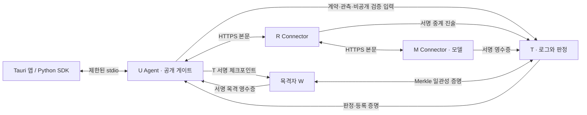

# itx Desktop v0.3 — 설치·구현·검증

갱신: 2026-09-13. 기준 계획: `desktop-product-plan-2026-09-11.md`.

Windows 설치 앱에서 U Agent가 R/M에 실제 HTTPS 요청을 보내고, 서명 증거로 응답 공개를 결정한다.
v0.3은 운영자별 키 등록·공동 합의, 키 교체, 별도 목격자 W, 외부 감사 패키지, Python SDK를 추가했다.
검증 환경은 **같은 Windows PC, 실제 루프백 TLS, 모형 모델**이다. 독립 사업자·별도 호스트·실제 LLM의 실증 결과가 아니다.

## 설치와 사용

1. `desktop/src-tauri/target/release/bundle/nsis/itx_0.3.0_x64-setup.exe`를 실행해 현재 사용자에게 설치한다.
2. 시작 메뉴의 **itx**를 실행하고 첫 키·인증서 생성 후 `U Agent 연결됨`을 확인한다.
3. `정상 경로`, `strict`로 모형 요청을 실행한다. 검증된 응답이 표시된다.
4. `R의 응답 변조`, `protect`로 실행한다. 응답 본문은 공개되지 않고 격리된다.
5. T 판정 갱신에서 E6·E7은 일치하나 E10은 실패하는 반례를 확인한다.
6. `배포와 키`에서 운영자별 신뢰 설정을 만들고 `감사 자료`에서 연결 점검·목격·내보내기·오프라인 검증을 실행한다.

설치된 앱은 Python·Node·Rust를 요구하지 않는다. WebView2는 필요하며 Tauri NSIS의 설치 절차에서 처리한다.
현재 산출물은 **코드 서명이 없는 개발 평가판**이다. 새 Windows PC 설치와 GUI 전체 조작 검증은 별도 완료 조건이다.
기존 버전은 새 설치 파일로 업데이트한다. 무인 자동 업데이트 서버는 없다. 기존 사용자 데이터는 유지한다.

## 보호 경계



T는 본문 중개 경로 밖에 있다. 보호 경계는 U가 검증 후 `response`에 본문을 넣어 앱/SDK로 반환하는 지점이다.
격리 원문은 일반 IPC·사건 내보내기에 포함하지 않는다. 사람의 열람이나 외부 업무 실행 완료까지 측정하지 않는다.
외부 소비 앱은 SDK 반환 후에 업무를 수행해야 한다. 다른 브라우저·AI 앱의 트래픽을 자동으로 가로채지는 않는다.

| 모드 | 정상 | 무결성 실패 | T 중단 |
|---|---|---|---|
| observe | 미검증 수용 | 미검증 수용 | 계속, 증거 큐 보관 |
| protect | 필수 로컬 검사 후 수용 | 공개 전 격리 | 유효 정책·필수 증거가 있으면 수용 |
| strict | 로컬 검사와 인증된 T 판정 후 수용 | 공개 전 격리 | 기본 2,500 ms 판정 대기 후 거부 |

2,500 ms는 응답 수신 후 판정 대기 예산이며 전체 소요 시간이 아니다.
T의 서명·발행자·요청·시도·계약·정책·검사기·유효기간·등록 증명을 검증한다. 사후 판정 갱신으로 과거 수용 결정을 바꾸지 않는다.
U는 공개 직전에도 정책 만료/배포 폐기를 확인한다. 선택적 M 게이트는 실제 입력 커밋을 서명 계약과 실행 전에 비교한다.
T 중단은 실제 프로세스 종료이며 증거는 영속 큐로 보관한다. 실행 결과가 불명인 중단 요청은 자동 재실행하지 않는다.
앱 종료 시 Agent와 실험실 서비스도 종료한다. 상주 데몬은 없다. 재시작한 미완료 요청은 응답을 공개하지 않는 `interrupted`로 복구한다.
앱/SDK/CLI가 같은 U 설정을 동시에 쓰면 OS 저장소 잠금으로 거부한다.

## 이번에 추가한 기능

| 기능 | 동작과 경계 |
|---|---|
| 운영자 등록 | 각 계정에서 키·공개 카드 생성, URMT 필수·W 선택, 전원 서명 합의 |
| TLS 신뢰 분리 | 대상 역할의 CA만 신뢰. R의 CA로 M을 인증하지 못함 |
| 키 교체 | 이전 합의·체크포인트 연결, 이전/새 키 이중 승인, 세대별 로그·정책 보존 |
| 폐기 | 활성화한 로컬 역할의 이전 설정은 새 요청 거부. 원격 동시 전환은 수동 조율 |
| 감사 | 모든 등록 영수증과 인증된 모든 과거 판정 검사. 나중의 정답으로 과거 오판을 숨기지 못함 |
| 감사 패키지 | U 서명, 배포 승인 계보, 로그·헤드·목격 자료, 외부 고정 신뢰 입력 |
| 비공개 감사 | 지정 감사자용 X25519/HKDF-SHA256/AES-256-GCM 암호화, 입력 버전별 판정 재현 |
| W | 별도 키/저장소, 롤백·같은 크기 분기·증가한 트리의 일관성 검사, 서명 목격 영수증 |
| SDK | stdio 기반 Python 클라이언트, protect/strict 수용 본문만 반환, 거부 예외에 본문 없음 |
| 보관 정리 | 기본 30일이 지난 U 본문/비공개 입력, 미리보기 후 적용, 서명·집행 기록 보존 |

최초 카드·배포 지문은 별도 신뢰 채널에서 확인해야 한다. 역할별 키만으로 실제 조직의 독립성이 증명되지는 않는다.
W가 관측하지 않은 분기나 T/W 공모를 모두 발견한다고 주장하지 않는다. `anchor_digest`를 만들지만 체인에 게시하지 않으며 `on_chain=false`다.
기존 `run.py`와 HTML 참조 보고서는 `mock_result`로 유지한다.

## 감사 자료와 저장

감사자는 패키지와 **별도로 받은 신뢰 파일·지문**을 사용한다. T가 내보낸 키를 그대로 신뢰하지 않는다.
한 서명 헤드를 고정해 64개 이하 페이지로 내려받으며 각 영수증의 서명·잎·순서·시각·접두 트리 루트를 재계산한다.
각 판정 이전에 있던 증거로 모든 인증 판정을 재현한다. 배포 합의서의 이전/새 키 승인 계보도 검증한다.

- 사건 결과: 수용된 응답·공개 사건·판정. 모형 응답에는 입력 문장이 반복될 수 있다.
- 공개 감사: 서명 증거·영수증·정책 이력·목격 자료. salt·비공개 입력 제외, 해당 검사는 부분 감사로 표시한다.
- 암호화 감사: 지정 감사자의 키로만 복호화. U가 보관한 비공개 검증 입력과 과거 버전을 추가한다.
- 신뢰 파일: 고정 신원·정책·모델 기준·검사기·배포 해시. 지문은 독립적으로 확인한다.

원문 프롬프트/응답과 개인 서명 키는 감사 패키지에 넣지 않는다. 비공개 입력은 salt·본문 해시·기대 커밋이며 추측 공격의 단서가 될 수 있어 암호화 내보내기로 제한한다.
보관 정리 후 입력이 없으면 `private_scope=partial`이다. 전체 감사를 보존하려면 정리 전에 암호화 패키지를 저장한다.
공통 검사기를 재사용하므로 공통 구현 오류는 외부 검토나 별도 구현으로 보완해야 한다.

기본 데이터 위치는 `%LOCALAPPDATA%\dev.itx.desktop`이다. Windows 패키지 격리 환경에서는 경로가 리디렉션될 수 있다.
`lab/`는 실험실, `operators/`는 역할별 키와 `epochs/<hash>/config.json`, `auditors/`는 복호화 키, `exports/`는 내보내기다.
서명 키와 SQLite 레코드는 Windows DPAPI로 보호한다. 같은 사용자 권한의 악성 프로세스나 관리자 침해까지 막지는 못한다.
v0.3 운영자 TLS 키는 암호화 PEM이고 비밀번호는 DPAPI로 보호한다. 기존 실험실 TLS 키는 사용자 폴더 권한에 의존하는 PEM이다.
POSIX 소스 실행은 파일 권한만 적용하며 동등한 저장 암호화를 제공하지 않는다.

본문 정리는 U 로컬만 대상으로 한다. 5분 이내 미리보기와 동일한 기록이어야 하며 제출 대기 요청은 제외한다.
R/M 실행 캐시·T 비공개 입력·기존 내보내기 파일은 정리하지 않는다. SQLite/WAL·백업·저장장치의 포렌식 소거는 보장하지 않는다.
앱 제거는 원격 T 기록 삭제와 별개이며 재설치를 위한 로컬 데이터는 유지한다.

## 통신 프로파일과 한도

- 비스트리밍 텍스트 `{"prompt":"..."}` → `{"text":"..."}`. 도구·이미지·임의 옵션 없음.
- 자체 JSON 정규화: 중복 키·부동소수·NaN·비 ASCII 객체 키 거부, 한글 문자열 값 허용. 표준 적합성 인증을 주장하지 않음.
- prompt 16,000자, response 128,000자, HTTP 2 MiB, 감사 전체 64 MiB, 로그 100,000건, U/R/M 요청 보관 10,000건 상한.
- HTTPS/TLS 1.2 이상, 대상별 CA, 자동 리다이렉트·환경 프록시 없음. 서명 RPC 클라이언트 인증이며 mTLS는 아님.
- RPC `actor,target,operation,id,time,payload,signature`; 역할별 권한과 60초 시각 허용 범위 검사.
- 계약·M 영수증·R 진술·U 관측·T 판정은 별도 서명. R이 자기 키로 M 영수증을 발행할 수 없음.
- 큐 기본 256건, 서버 동시 처리 8, TLS/본문 읽기 제한, 로그 단일 작성자. 운영급 DDoS 방어·부하 분산 없음.

최대치는 입력/보관 제한이며 해당 규모의 성능 검증 결과가 아니다. 접두 트리를 반복 계산하는 현 감사는 큰 이력에서 비용이 증가한다.

## 검증 결과

`artifacts/tests-v0.3-2026-09-13.txt`: **82개 테스트 통과**. 배포·키 교체·암호화·잘못된 신뢰·역할 CA 대체·역사 판정·SDK·모델 HTTP fixture를 포함한다.
모델 fixture는 실제 로컬 HTTP로 정상 응답, 중복 키, 잘못된 모델명, 미완료 응답, 크기 초과, 리다이렉트를 시험한다. 실제 LLM 추론 시험은 아니다.

`artifacts/benchmark-v0.3-2026-09-13.json`: 조건당 10회, 9조건, 총 90회, 동시성 1, 모형 모델·루프백 TLS.

| 조건 / 모드 | 기한 5초 내 검증 수용 | 공개 전 공격 격리 | p50 / p95 (ms) |
|---|---|---|---|
| 정상 protect | 10/10 | 해당 없음 | 110 / 125 |
| 정상 strict | 10/10 | 해당 없음 | 219 / 922 |
| 응답 변조 protect | 0/10 | 10/10 | 94 / 141 |
| 응답 변조 strict | 0/10 | 10/10 | 94 / 188 |
| T 중단 protect | 10/10 | 해당 없음 | 235 / 375 |
| T 중단 strict | 0/10 | 해당 없음 | 2937 / 3688 |

observe는 미검증 수용이므로 안전 완료로 세지 않는다. 변조 observe 표본에 15,750 ms 지연 1건이 포함됐으며 제외하지 않았다.
백분위는 10개 표본의 nearest-rank로, p95는 최댓값이다. 한 PC의 총 소요 시간이며 실제 LLM/원격 성능이나 SLA 추정에 쓰지 않는다.
빌드 로그는 `.build/build-v0.3.log`, 패키징 검증은 `scripts/smoke-sidecar.py`, `scripts/smoke-extensions.py`로 재현한다.

패키징된 Agent 검증도 통과했다. `artifacts/packaged-v0.3-2026-09-13.json`은 응답 격리·T 장애 복구·재시작을,
`artifacts/packaged-extensions-v0.3-2026-09-13.json`은 5역할 등록·목격·서버 중지 후 공개/암호화 감사·키 교체·SDK를 기록한다.
2026-09-14 UI 미리보기에서는 7개 화면을 1320/900 px 너비에서 확인했다. 가로 넘침과 JavaScript 오류가 없으며 새 화면 이미지도 시각 점검했다.
결과는 `artifacts/ui-v0.3/result.json`이다. 이 검사는 빌드된 브라우저 미리보기의 레이아웃 검사이며 네이티브 Tauri GUI 전체 조작 시험을 대체하지 않는다.

## 개발·서명 배포

Windows 네이티브 CPython 3.12, Node 22 이상, pnpm 11, Rust MSVC, Visual Studio C++ Build Tools를 사용한다.

```powershell
python -m venv .venv
.venv\Scripts\python.exe -m pip install -r requirements-desktop.txt
.venv\Scripts\python.exe -B -m unittest discover -s tests -v
scripts/build-desktop.ps1 -Python .venv\Scripts\python.exe
.venv\Scripts\python.exe scripts/smoke-sidecar.py desktop\src-tauri\binaries\itx-agent.exe
.venv\Scripts\python.exe scripts/smoke-extensions.py desktop\src-tauri\binaries\itx-agent.exe
.venv\Scripts\python.exe runtime.py benchmark --output artifacts\my-benchmark.json --repeats 10
```

통신 런타임은 `cryptography`가 없으면 시작하지 않는다. PyInstaller는 변환 해시 재현용 `itx/reconcile/transforms.py`도 포함한다.
빌드 도구 준비는 `scripts/bootstrap-windows.ps1`에 있다.

서명 인프라가 준비되면 빌드에 `-SigningConfig <Tauri 추가 JSON>`과 `-AgentSignScript <서명용 .ps1>`를 함께 지정한다.
서명 스크립트는 첫 인수인 Agent 파일을 서명하고 실패 시 예외를 발생시킨다. 키·인증서를 자동 검색하거나 생성하지 않는다.
Agent 서명 확인 후 NSIS에 포함하며 Tauri 설정으로 앱/설치 파일도 서명하고 Authenticode 상태를 검사한다.
인증서가 없어 이 서명 옵션 경로는 실행하지 않았다. 공급자의 현재 서명 방식에 맞춰 설정한다. [Tauri Windows 서명](https://v2.tauri.app/distribute/sign/windows/)

## 계획 대비 상태

| 단계 | 구현 | 별도 환경 또는 후속 검증 |
|---|---|---|
| P0/P1 | Windows NSIS, 동봉 Agent, 분리 TLS, U 공개 전 집행 | 개발 도구 없는 새 PC, 별도 호스트 연결 |
| P2 | 운영자별 등록·CA, 키 교체·폐기, U 보관 정책 | 실제 독립 운영자, 서버 장기 보관·백업·부하 운영 |
| P3 | 전체 과거 판정·영수증, W, 승인 이력, 암호화 오프라인 감사 | 별도 감사 구현, 다른 계정/호스트 자료 교환 |
| P4 | 반복 모형 TLS 평가, Ollama HTTP fixture, 패키징 | 실제 LLM, 코드 서명 인증서, GUI/새 PC 설치 검증 |
| P5 선택 | Python SDK, 별도 W, 앵커용 digest | 체인 게시·검증, 스트리밍·상주 데몬·다중 T 등 별도 범위 |

블록체인 게시로 전송 전 데이터의 정직성이나 실제 모델 실행을 증명할 수 있다는 주장을 하지 않는다.
이 구현은 서명 계약과 U 집행, T/W 사후 감사를 연결한다. 패킷 IDS·TEE·범용 프롬프트 인젝션 방어·R/M 공모의 완전 탐지·경제적 무손실은 보증하지 않는다.
