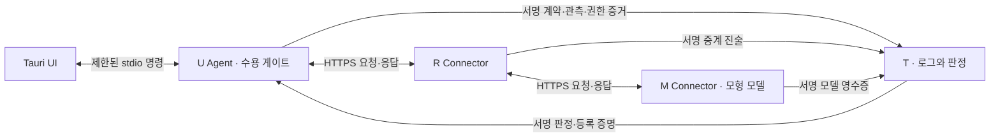

# itx Desktop v0.2 — 설치와 구현 범위

작성: 2026-09-11. 기준: `desktop-product-plan-2026-09-11.md`의 P0~P3 핵심 경로.

이 버전은 설치 가능한 **Windows 평가용 앱**이다. UI만 표시하는 보고서에서 실제 U Agent가
요청을 보내고, 분리된 R/M/T 프로세스의 TLS 통신·서명 증거를 이용해 응답 공개를 결정하는 단계로 확장했다.
현재 검증 환경은 같은 Windows PC의 루프백 TLS, 결정적 모형 모델, 단일 운영자다.

## 설치와 첫 실행

1. `desktop/src-tauri/target/release/bundle/nsis/itx_0.2.0_x64-setup.exe`를 실행한다.
2. 현재 Windows 사용자에게 설치한 뒤 시작 메뉴의 **itx**를 실행한다.
3. 첫 실행은 키·인증서 생성과 서비스 시작 때문에 잠시 걸린다. `U Agent 연결됨`을 확인한다.
4. `정상 경로`와 `protect`로 요청을 실행한다. 모형 모델의 응답이 검증 후 표시된다.
5. `R의 응답 변조`를 선택해 다시 실행한다. 일반 응답 영역에는 변조 본문이 전달되지 않고 `응답 격리`가 표시된다.
6. `T 사후 판정 갱신`에서 E6·E7 일치, E10 실패를 확인한다. `제3자 검증 → 감사 재실행`으로 T 판정을 검사한다.

Python·Node·Rust는 설치된 앱 실행에 필요하지 않다. WebView2 Runtime은 필요하며 NSIS의 Tauri 기본 설치 절차가 처리한다.
현재 산출물은 코드 서명이 없는 개발용 설치 파일이다. 배포 서명·깨끗한 PC 검증을 마친 상용 배포판은 아니다.
Windows의 보안 경고나 권한 설정을 변경하는 절차는 제공하지 않는다.

## 사용자 흐름과 구성



T는 본문 중개 경로에 들어가지 않는다. U가 본문을 보류하고 검증 결과에 따라 UI로 반환한다.
`response` 필드에 본문을 넣는 지점이 이 버전의 공개 경계다. 사람의 실제 열람이나 외부 업무 실행 완료를 측정한 것은 아니다.
사용 전 격리한 원문은 공개 IPC·사건 화면·결과 내보내기에서 제외된다.

| 부분 | 구현 |
|---|---|
| 설치 UI | Tauri 2, TypeScript, Vite, 로컬 자산·CSP·허용 명령 한정 |
| Rust Core | 동봉 Agent 시작, 구조화 명령 중계, 이벤트 수신, 종료 처리 |
| U Agent | CSPRNG 계약·nonce·salt, 발행 권한·서명·경로·종단 결합 검사, 3모드 |
| R/M | 각자 별도 프로세스·서명 키·TLS 인증서·실행 캐시·증거 큐 |
| T | 단일 로그 쓰기 순서, 등록 정책, Merkle 영수증, E1~E12, 서명 판정 |
| 저장 | 역할별 SQLite WAL/FULL, Windows DPAPI로 본문·키·증거 레코드 보호 |
| 감사 | T 내보내기 밖의 고정 공개키·정책, 사용자 PC의 이전 체크포인트, 판정 재계산 |

기존 HTML 콘솔과 `run.py`의 모의 결과는 유지한다. 앱의 `참조 시나리오`는 기존 엔진을 호출하며
`mock_result`로 표시한다. 앱의 `요청과 보호` 시간은 실제 U의 단조 시계로 측정한다.
네트워크 소요 시간에는 R/M 처리와 TLS 연결 등이 함께 포함되며 순수 전송 지연만을 분리한 수치는 아니다.

## 정책·장애·복구

| 모드 | 정상 응답 | 무결성 실패 | T 중단 |
|---|---|---|---|
| observe | 미검증 수용 | 미검증 수용 | 계속, 증거 큐 보관 |
| protect | 필수 로컬 검사 후 수용 | 공개 전 격리 | 유효 정책·필수 증거가 있으면 수용 |
| strict | 로컬 검사와 인증된 T 판정 후 수용 | 공개 전 격리 | 기본 2,500 ms 판정 대기 후 거부 |

strict의 2,500 ms는 응답 수신 후 T 판정 대기 예산이다. 전체 요청에는 별도의 R/M 호출 타임아웃이 있다.
T의 서명·발행자·요청 ID·시도 ID·계약 해시·정책 해시·검사기 버전·유효기간·등록 포함 증명을 확인한다.
T의 `passed` 문자열만으로 수용하지 않는다. T 판정을 사후에 갱신해도 이미 기록한 수용/격리 결정은 바꾸지 않는다.

실험실의 `T 중단`은 실제 프로세스를 종료한다. U/R/M은 증거를 영속 큐에 보관하며 복구 후 재제출한다.
큐 기본 한도는 256건이고 기존 증거를 밀어내지 않는다. 새 요청은 보관 여유가 부족하면 거부한다.
R/M은 동일 요청·계약·본문의 재제출에 기존 서명 결과를 반환한다. 실행 도중 중단돼 결과가 불명인 요청은 자동 재실행하지 않는다.

앱 종료는 Agent와 자식 서비스를 함께 종료한다. 비정상 종료 후 `pending` 요청은 다음 시작에서
`interrupted`로 복구하며 응답을 공개하지 않는다. 앱이 닫힌 동안 다른 프로그램을 보호하는 상주 데몬은 없다.
같은 앱 데이터 폴더나 같은 서비스 저장소에 두 프로세스가 동시에 쓰지 못하도록 OS 파일 잠금을 사용한다.

## 저장 위치와 데이터

설치 앱 데이터 기본 위치는 `%LOCALAPPDATA%\dev.itx.desktop`이다.

```text
dev.itx.desktop/
  connection.json          선택한 연결 설정 경로 (재시작 시 유지)
  app.lock                 프로세스 중복 실행 방지
  lab/U|R|M|T/
    config.json            공개 신원·TLS CA 위치·주소·정책 설정
    identity.key           Windows 사용자 계정에 DPAPI로 결합된 서명 키
    ca.pem                 배포별 신뢰 CA
    tls.pem, tls.key       R/M/T TLS 인증서·개인키
    state.sqlite           DPAPI 보호 레코드, 로그·실행 캐시·증거 큐
    service.stderr.log     오류 종류와 코드 위치 (본문·키·RPC 페이로드 제외)
  exports/                 사용자가 내보낸 결과 JSON
```

DPAPI는 같은 Windows 사용자 권한의 악성 프로세스나 관리자 침해까지 막는 경계가 아니다.
TLS 개인키 파일은 PEM으로 저장되며 OS 사용자 폴더 권한에 의존한다. POSIX 소스 실행은 파일 권한만 적용하고 DPAPI와 같은 저장 암호화를 제공하지 않는다.
키와 실험 정책·TLS 인증서는 첫 배포에서 생성하며 기본 90일 유효하다. 자동 갱신·키 회전은 아직 제공하지 않는다.

결과 내보내기에는 **수용된 응답**이 포함된다. 모형의 응답은 요청을 반복하므로 요청 내용이 결과에 포함될 수 있다.
격리 원문·salt·개인키·비공개 감사 입력은 내보내지 않는다. 결과 JSON은 화면 결과 공유용이며, 다른 운영자가 전체 판정을 재실행할 수 있는 완전한 증거 패키지는 아니다.
제거 후 재설치를 위해 앱 데이터는 유지한다. 데이터 정리는 앱 종료 후 해당 사용자 폴더를 별도로 관리해야 한다.
T가 별도 운영되는 연결 모드에서는 앱 제거와 T 기록 삭제가 별개다.

## 통신 프로파일 v1

- 앱 요청 범위: 비스트리밍 텍스트 `{"prompt":"..."}`, 응답 `{"text":"..."}`. 도구·이미지·옵션 확장 없음.
- 메시지 정규화: 기존 자체 JSON 프로파일. 중복 키·부동소수·NaN·비 ASCII 객체 키는 거부한다. 문자열 값에는 한국어를 허용한다.
- prompt 16,000자, response 128,000자, HTTP 본문 2 MiB. T 전체 로그 내보내기도 2 MiB 한도다.
- HTTPS CA 검증, TLS 1.2 이상. 자동 리다이렉트와 환경 프록시는 사용하지 않는다.
- `/rpc` POST: `actor,target,operation,id,time,payload,signature`. 마지막 필드를 제외한 정규화 바이트에 Ed25519 서명. 시각 허용 오차 60초.
- 호출 권한: U→R infer; R→M infer; U/R/M→T 각자 유형의 submit; U→T verdict/audit.
- 전송 클라이언트 인증은 서명 RPC다. TLS 클라이언트 인증서를 요구하는 mTLS 구현은 아니다.
- 계약·모델 영수증·중계 진술·수신 관측·T 판정은 별도 서명 봉투다. 신뢰 목록에 있는 R도 M 영수증을 발행할 권한은 없다.
- 실행 중복 방지는 RPC ID만으로 하지 않는다. 계약·요청 ID·nonce와 실제 입력 결합을 영속 저장하고 확인한다.
- T의 서명 진술 재제출은 동일 해시의 등록 영수증을 반환한다. 상충하는 같은 유형의 진술은 v1에서 거부한다. T 판정은 후속 증거에 따라 추가 발행할 수 있다.
- 서버별 동시 처리 상한 8, TLS handshake와 본문 읽기 타임아웃을 둔다. 운영급 DDoS 방어·부하 분산을 구현한 것은 아니다.

감사는 최신 인증 판정의 **등록 시점 이전 증거**로 그 판정을 재현한다. 판정 뒤 도착한 증거는
`evidence_after_verdict`로 표시하며 과거 오판으로 단정하지 않는다. 현재 모든 과거 판정을 전수 비교하지 않고 요청별 최신 판정을 비교한다.
기존 검사기를 재사용한 감사이므로 공통 검사기 오류는 별도 구현·외부 검토로 보완해야 한다.

## 개발자 실행과 빌드

Windows 네이티브 CPython 3.12, Node 22 이상, pnpm 11, Rust MSVC와 Visual Studio C++ Build Tools를 사용한다.
MSYS Python 대신 Windows CPython으로 DPAPI와 PyInstaller를 실행한다.

```powershell
python -m venv .venv
.venv\Scripts\python.exe -m pip install -r requirements-desktop.txt
.venv\Scripts\python.exe -B -m unittest discover -s tests -v
powershell -ExecutionPolicy Bypass -File scripts/build-desktop.ps1 -Python .venv\Scripts\python.exe
```

시스템에 없는 빌드 도구는 `scripts/bootstrap-windows.ps1`로 준비할 수 있다. 대용량 다운로드와 Visual Studio 설치가 포함되며 실행 전 스크립트를 검토한다.
빌드 스크립트는 프로젝트의 `.toolchain`에 설치한 Rust가 있으면 사용한다.
`cryptography`가 없는 실제 통신 런타임은 시작을 거부하고 순수 Python 서명으로 대체하지 않는다.
PyInstaller는 검사기의 변환 정의 해시를 동일하게 재현하도록 `itx/reconcile/transforms.py` 소스도 동봉한다.

```powershell
# 설치형 Agent와 같은 실행 경로를 소스에서 점검
.venv\Scripts\python.exe runtime.py desktop --data-dir .runtime\dev
# 패키징된 Agent의 실제 TLS·집행·감사 검증
.venv\Scripts\python.exe scripts/smoke-sidecar.py desktop\src-tauri\binaries\itx-agent.exe
```

## 연결 모드와 실제 모델 확장

`runtime.py init --directory .runtime\connected --connected`는 공격 주입을 끈 같은 운영자 평가 배포를 만든다.
각 역할은 `runtime.py service --config <역할\config.json>`로 따로 실행한다. 기본 포트는 T 8741, M 8742, R 8743이다.
앱의 `연결 설정`에 U 설정 경로를 적용하면 저장된 HTTPS 주소로 통신하며 로컬 실험실은 종료된다.
설정이 유효하지 않거나 파일이 사라지면 다른 T나 실험실로 자동 전환하지 않는다. 사용자가 연결을 복구하거나 실험실을 선택한다.

원격 주소도 전송 계층에서 지원하지만 **이번 버전은 별도 호스트 재현을 완료하지 않았다**.
원격 배포에는 호스트명이 인증서 SAN과 일치하는 인증서, 해당 서버의 바인딩·도달 가능 포트,
역할별 로컬 키 생성과 공개키 교환이 필요하다. 현재 `init`의 Windows 키는 생성 계정의 DPAPI에 결합되므로 폴더를 다른 PC에 복사하는 것만으로 독립 배포가 되지 않는다.
독립 운영자 등록·CA 관리·키 교환 마법사는 후속 개발 대상이다.

M의 선택 어댑터는 Ollama `/api/generate`의 `stream=false` 텍스트 응답을 지원한다.
연결 배포의 M 설정에 `model_kind=ollama`, `model_endpoint`, `model_name`을 명시한다. endpoint는 HTTPS 또는 명시한 루프백 HTTP만 허용한다.
U/R/M/T 설정의 논리 모델 ID·기준 해시는 운영자가 별도로 합의해야 하며 문자열 선언만으로 실제 모델 실행이 증명되지는 않는다.
현재 서버가 없어 실제 LLM 호출은 시험하지 않았다. 기본 모형 모델의 동작 검증과 구분한다.

## 개발 계획 대비 남은 항목

| 단계 | 현재 상태 | 남은 완료 조건 |
|---|---|---|
| P0 | Windows NSIS·동봉 Agent·기존 시나리오·명령/오류 처리 구현 | 서명 배포·새 PC 설치 검증 |
| P1 | 분리 프로세스 TLS·M 영수증·종단 격리 구현 | 별도 호스트 TLS 재현 |
| P2 | 무작위 키·발행 권한·판정 인증·큐·로그·장애·재시작 구현 | 독립 운영자 등록·키 회전·운영 부하·장기 저장 정책 |
| P3 | 고정 신뢰 기준·체크포인트·최신 판정 재실행·사건 UI 구현 | 독립 목격자·과거 판정 전수 비교·외부 감사 패키지·정책 이력 |
| P4 | 설치 파일과 Ollama 어댑터 구현 | 실제 LLM·새 Windows 환경·반복 성능 평가 |
| P5 | 착수하지 않음 | 외부 앱 SDK·독립 목격자·체인 앵커 등 |

블록체인은 현재 사용하지 않는다. 서명 계약으로 전송 전 약속을 고정하고, 로그와 사용자 체크포인트로 사후 변경을 검사하는 경계를 먼저 구현했다.
이 앱은 다른 브라우저·AI 앱의 트래픽을 가로채지 않으며 패킷 IDS, TEE, 범용 프롬프트 인젝션 방어, 공모 탐지, 의미적 정답 보증을 제공하지 않는다.
